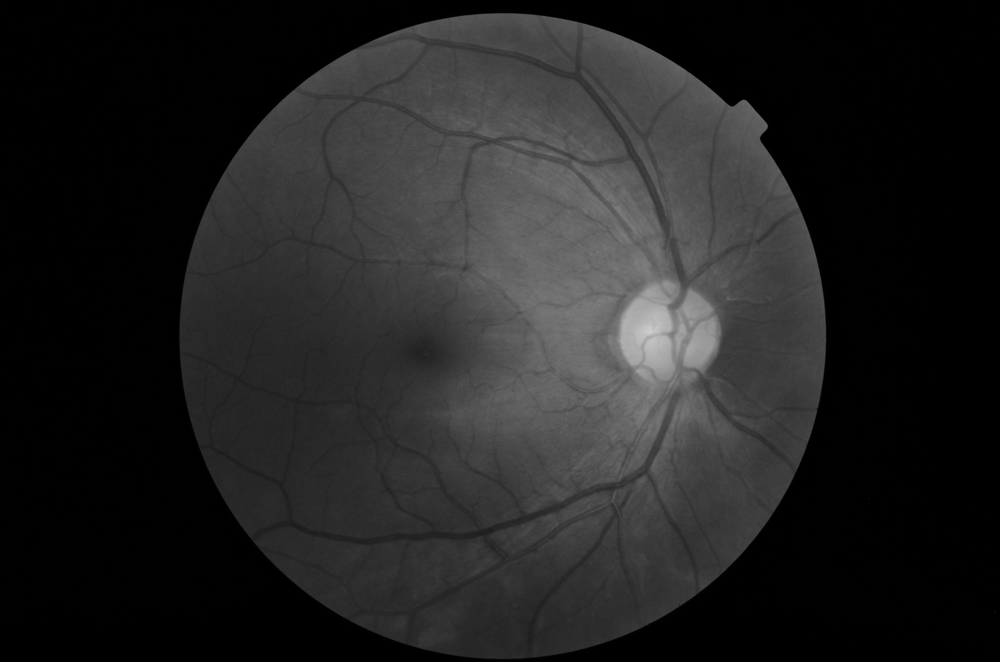
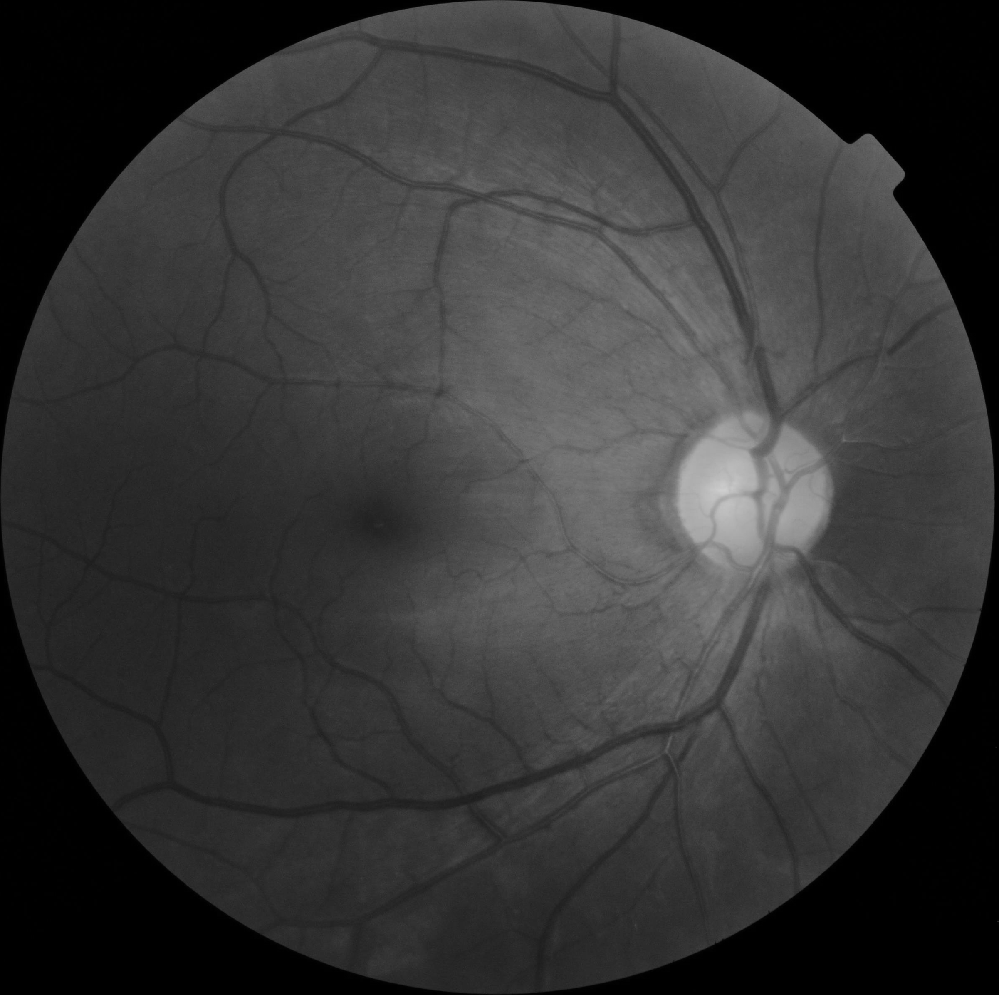
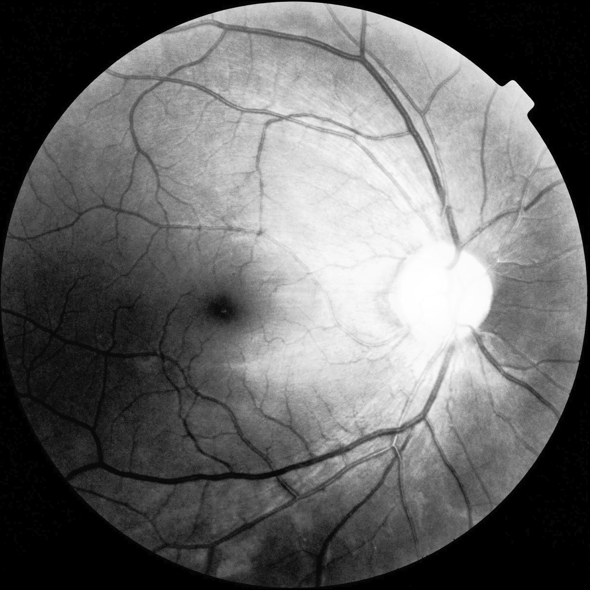
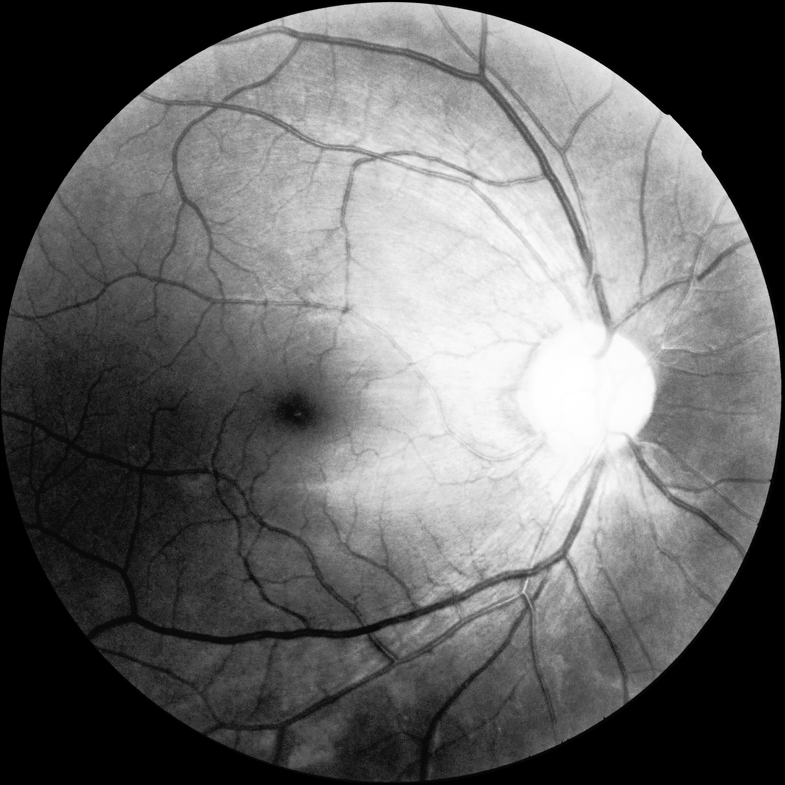
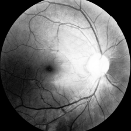

## Preprocessing Images for Retinal Photography

python version : 3.9.7
requirements : opencv-python

```bash
pip install opencv-python
```

## Usage

```bash
python preprocess_image.py <image_path>
# example) python preprocess_image.py sample_image.png
```

## Results - preview step by step
### Input Image


### Step1 : Conver image into grey scale


### Step2 : Remove black area from the image


### Step3 : Apply contrast enhancement


### Step4 : Make image square 


### Step5 : Crop circle to remove outliers from image


### Step6 : Crop top and bottom to make images equal


